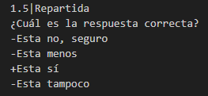
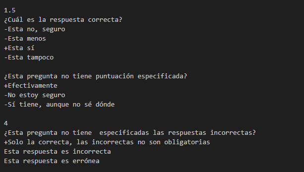

  

  

# MoodleQuizFromFile

  

  

## Spanish version below:

  

  

Esta es una aplicación orientada a una rápida conversión de un archivo .txt que contenga preguntas para un cuestionario Moodle en un archivo MoodleXML compatible con la importación en las aulas virtuales de Moodle.

  

  

Es posible aplicar una puntuación diferente para cada una de las preguntas. La aplicación pretende ser de utilidad a la hora de aplicar puntuaciones diferentes con la intención de ajustarse a los pesos de los criterios especificados por resultados de aprendizaje.

  

  

Se calcula automáticamente la penalización para las respuestas erróneas.

  

  

### Formato del archivo de texto de preguntas

  

  

- La idea es que el archivo que guarde las preguntas sea fácil y rápido de escribir. Para ello es posible usar un **número indeterminado mayor o igual a 1 de saltos de línea entre bloques de preguntas**.

  

-  **Las líneas pertenecientes a una pregunta deben ir pegadas**, sin saltos de líneas intermedios, para permitir su procesamiento correcto.

  

- Es posible especificar **(no es obligatorio)** la puntuación específica para cada una de las preguntas, **en el caso de que no se especifique se aplicará una puntuación de 1 y se aplicará una penalizada de tipo Repartida.**

  

- La puntuación de la pregunta se refleja en la primera línea de cada una de las preguntas, con el formato siguiente:

  

-  **Puntuación | Estilo de penalización**, por ejemplo, para una pregunta que tiene una puntuación de 2 puntos y la penalización es equivalente a aplicar la fórmula **Valor_de_acierto/Número_de_opciones** se haría de la siguiente manera: **2|Repartida**.

  

- Los tipos de puntuación que existen en la aplicación son 2: **Repartida** y **Media**. El tipo de penalización **Repartida** calcula automáticamente la penalización dividiendo la puntuación entre el número de opciones de la pregunta, mientras que el tipo de penalización **Media** divide entre dos la puntuación de la pregunta y lo aplica como penalización a las respuestas erróneas.

- El texto de la pregunta se escribe como 1ª línea de un bloque de pregunta cuando no se especifica la **puntuación|penalización**, en caso de que se especifique será la 2ª línea.

- Debajo del texto/enunciado de la pregunta se escribirán las líneas que definen las posibles opciones de respuesta. Cada una de las opciones puede ser o la correcta **(única)** o las respuestas incorrectas. Para diferenciar las correctas de las incorrectas, se escribe pegado al texto de respuesta un **+** para las correctas o un **-** en el caso de las incorrectas.
- Es irrelevante el orden las respuestas, pero siempre tiene que haber una única respuesta correcta y deben aparecer los signos de **+** y **-** para que pueda convertir el fichero correctamente. A continuación se muestra un ejemplo de pregunta donde se especifica la puntuación y tipo de penalización.
  
 

  

## English version below:

  

  

In construction...
