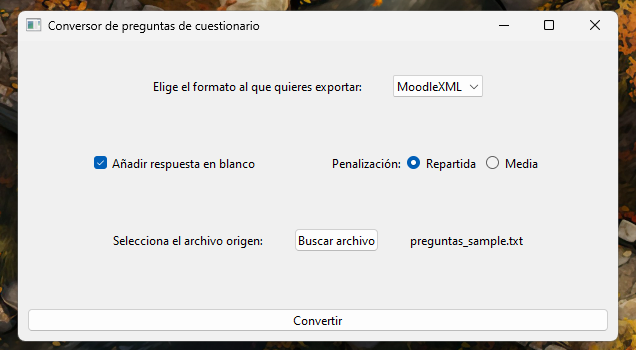

# MoodleQuizFromFile

## Spanish version below:

Esta es una aplicación **por y para profesores** orientada a una rápida conversión de un archivo .txt que contenga preguntas para un cuestionario Moodle en un archivo MoodleXML u otros formatos compatibles con la importación en las aulas virtuales de Moodle, ya sea de **EducaMadrid** u otras comunidades autónomas y regiones.

Es posible aplicar una puntuación diferente para cada una de las preguntas. La aplicación pretende ser de utilidad a la hora de aplicar puntuaciones diferentes con la intención de ajustarse a los pesos de los criterios especificados por resultados de aprendizaje.

Se calcula automáticamente la penalización para las respuestas erróneas.

### Instalación de la aplicación
Se trata de un programa Python con varias dependencias, por lo que **lo más sencillo es descargar el ejecutable de la última versión, que se encuentra en [releases](https://github.com/Josemedvel/MoodleQuizFromFile/releases)**. Lo único que hay que hacer es descargar el archivo .exe que se encuentra en Assets y ejecutarlo para abrir la interfaz.

### Formato del archivo de texto de preguntas

- La idea es que el archivo que guarde las preguntas sea fácil y rápido de escribir. Para ello es posible usar un **número indeterminado mayor o igual a 1 de saltos de línea entre bloques de preguntas**.

-  **Las líneas pertenecientes a una pregunta deben ir pegadas**, sin saltos de líneas intermedios, para permitir su procesamiento correcto.

- Es posible especificar **(no es obligatorio)** la puntuación específica para cada una de las preguntas, **en el caso de que no se especifique se aplicará una puntuación de 1 y se aplicará una penalizada de tipo Repartida.**

- La puntuación de la pregunta se refleja en la primera línea de cada una de las preguntas y puede ser un **número entero o decimal con punto**.

- Los tipos de penalización que existen en la aplicación son 2: **Repartida** y **Media**. El tipo de penalización **Repartida** calcula automáticamente la penalización dividiendo la puntuación entre el número de opciones de la pregunta, mientras que el tipo de penalización **Media** divide entre dos la puntuación de la pregunta y lo aplica como penalización a las respuestas erróneas.

- El texto de la pregunta se escribe como 1ª línea de un bloque de pregunta cuando no se especifica la **puntuación**, en caso de que sí se especifique, será la 2ª línea.

- Debajo del texto/enunciado de la pregunta se escribirán las líneas que definen las posibles opciones de respuesta. Cada una de las opciones puede ser o la correcta **(única)** o las respuestas incorrectas. Para diferenciar las correctas de las incorrectas, se escribe pegado al texto de respuesta un **+** para las correctas o un **-** en el caso de las incorrectas. Para hacerlo más cómodo, no es obligatorio escribir el **-** de las incorrectas, solo el **+** de las correctas.

- Es irrelevante el orden las respuestas. A continuación se muestra un ejemplo de pregunta donde se especifica la puntuación.

### Interfaz gráfica

Se incluye una interfaz gráfica para poder utilizar la aplicación más fácilmente, está escrita con PySide6 y aunque es muy básica sirve para su propósito.

- Se puede elegir el formato de salida deseado, a partir de un menú desplegable.
- Hay una casilla que se puede marcar para **añadir de forma automática una opción de respuesta que sirva para dejar la pregunta en blanco**, donde no afectaría la penalización.
- Mediante dos botones podemos seleccionar el tipo de penalización a aplicar (en el caso de no querer aplicar una penalización siempre podemos exportar el archivo como Aiken)
- Se puede elegir un archivo a convertir con el botón que está dedicado a ello, cuando un archivo esté seleccionado, aparecerá su nombre a la derecha.
- Un vez se clica el botón de **Convertir**, se debe elegir la carpeta donde se guardará el archivo generado, con el nombre deseado.

### Importación del archivo en Moodle
Una vez esté el archivo generado, lo único que tenemos que hacer para poder usarlo es ir a un aula virtual Moodle, por ejemplo EducaMadrid. En la opción **Más** encontraremos el **Banco de preguntas**. Clicamos sobre él.

Dentro del **Banco de preguntas** podemos tener más o menos categorías creadas, pero para importar las preguntas de nuestro cuestionario generado clicamos en **Preguntas** y seleccionamos **Importar**.

Al darle clic en **Importar** veremos que nos dejan elegir entre varios formatos, elegiremos el formato que sea nuestro archivo generado y lo arrastraremos en la parte de abajo.

Por último clicaremos en **Importar** y nos avisará de las preguntas que está cargando en nuestro banco de preguntas, ya estaría terminado, solo quedaría clicar en continuar.

Espero que sea de utilidad para vuestros tipo test.
## English version below:

In construction...
